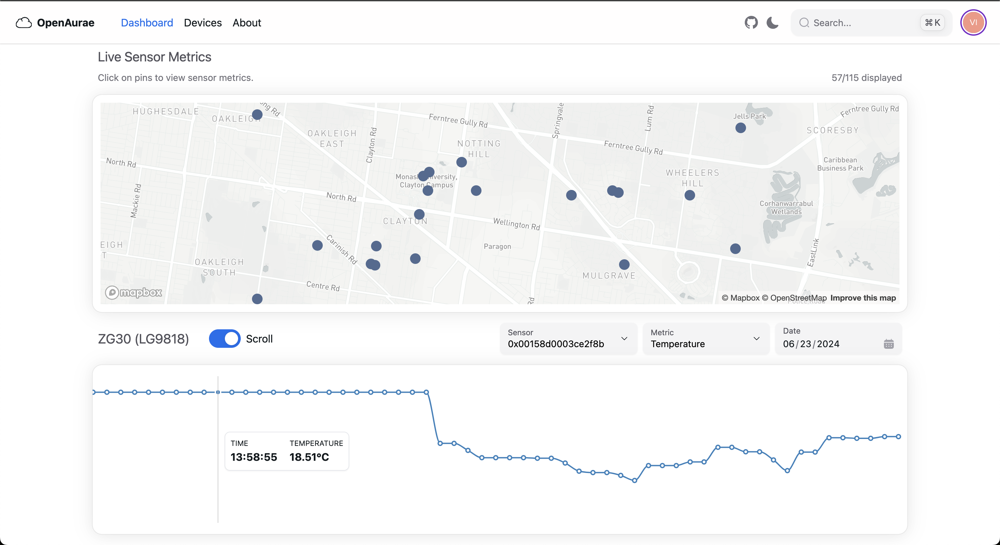

# OpenAurae Web Client



## Technologies Used

This project is developed based on [NextUI Vite template](https://github.com/nextui-org/vite-template)
via `nextui init`.

- [Vite](https://vitejs.dev/guide/)
- [NextUI](https://nextui.org)
- [Tailwind CSS](https://tailwindcss.com)
- [Tailwind Variants](https://tailwind-variants.org)
- [TypeScript](https://www.typescriptlang.org)
- [Framer Motion](https://www.framer.com/motion)
- [Recharts](https://recharts.org/en-US/)
- [react-map-gl](https://visgl.github.io/react-map-gl/)
- [SWR](https://swr.vercel.app/)
- [React Router](https://reactrouter.com/en/main)

## Contribute

```bash
npm install # install dependencies
npx run prepare # install pre-commit hooks

npm run dev # run the dev server
```
